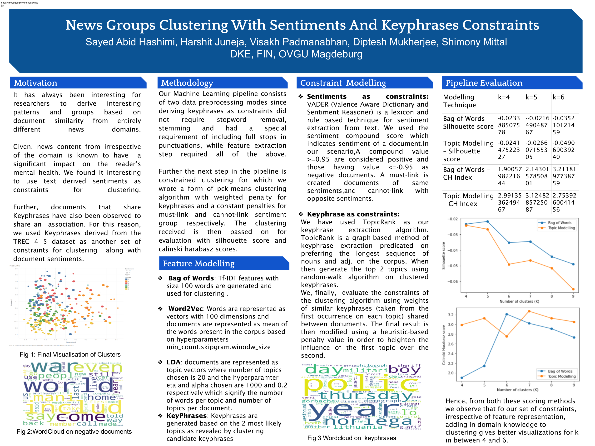

# Introducing constraints into k-means clustering and evaluating with TREC 4 5 data set

Step 1: Install Dependencies: 

1. scikit-learn
2. Gensim
3. python 3

Step2: Download the TREC 4 5 dataset

Step 3: Pre-processing

1. Make sure the TREC_4_5 dataset is in the base folder
2. preprocessing.py extracts article data along with document id from the xml tags
3. output is data.csv

Keyphrase relevant pre-processing: 
Use `mode` flag assigned as `kp` for keyphrase specific pre-processing. It doesn't include stopword removal and stemming. Keyphrases extracted from documents are further used as a weighted constraint while performing clustering.

Step 4: Feature extraction

We are building 4 piplines for evaluation which consume the extracted features for clustering and then further for evaluation.

Feature set 1: bag of words approach, feature vector = 1000, 500, 1500

Feature set 2: word embedding approach with topic modelling i.e features as topics

Feature set 3: LDA analysis (again a form of topic modelling with weights as feature values for topics)

Feature set 4: a combination of topic modelling by combining feature set 1 and 2 and taking a PCA of the obtained feature set

Eeach feature set amongst these has a csv file as it's output which is further used for clustering.

Step 5: Constraint Extraction:

1. Sentiments derived from news articles. Pairwise clustering of positive articles

2. **Keyphrasification**: Please check out the comments in `keyphrase_extraction.py` before using the routine.

Poster:

